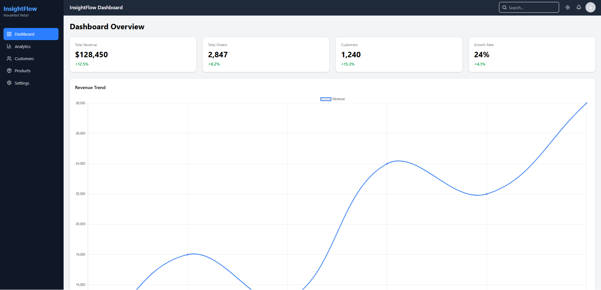
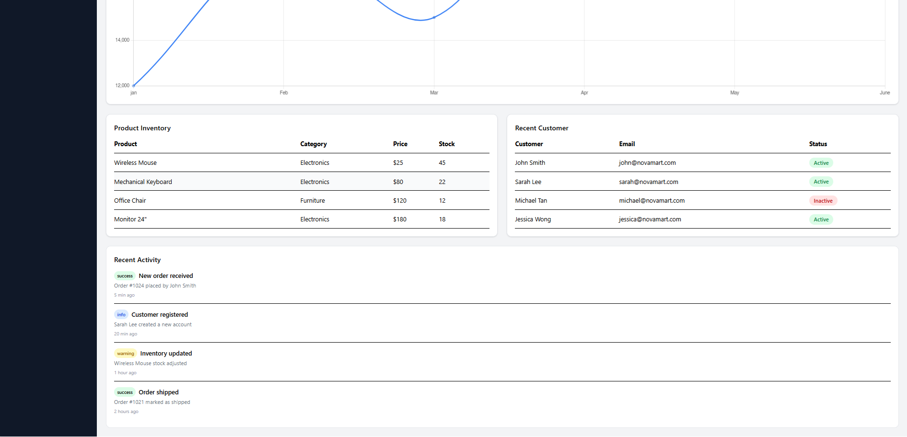
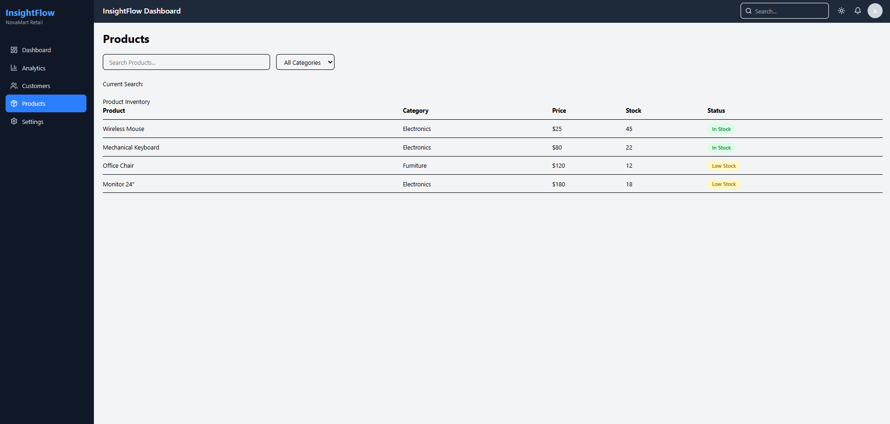
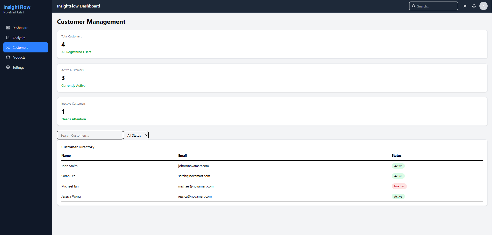
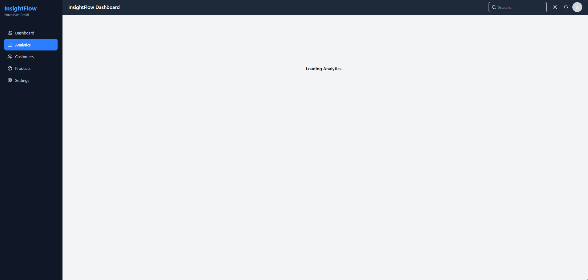
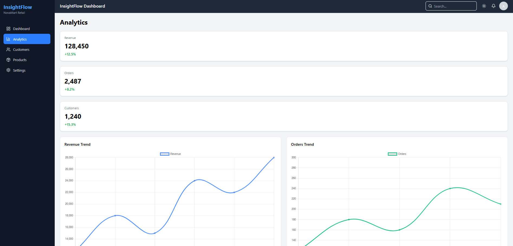
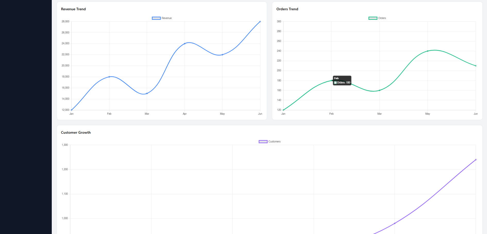

# NovaMart Retail Dashboard

A responsive admin dashboard built with React JS for managing retail business operations. The project includes product management, customer management, analytics reporting, and dashboard monitoring features.

## Features

- Dashboard overview with KPI cards
- Revenue analytics and business charts
- Product inventory management
- Product search and category filtering
- Customer management dashboard
- Customer search and status filtering
- Recent activity feed
- Stock status indicators
- Dark mode support
- Loading, empty, and error states
- Responsive design for desktop and mobile devices

## Tech Stack

- React JS
- HTML5
- CSS3
- Tailwind CSS
- React Router DOM
- Chart.js
- Git
- GitHub

## Project Structure

```txt
src/
├── components/
├── pages/
├── data/
├── context/
├── assets/
└── App.jsx
```

## Getting Started

Clone the repository:

```bash
git clone https://github.com/YOUR_USERNAME/novamart-retail-dashboard.git
```

Navigate to the project folder:

```bash
cd novamart-retail-dashboard
```

Install dependencies:

```bash
npm install
```

Start the development server:

```bash
npm run dev
```

Build for production:

```bash
npm run build
```

## Screenshots

Add screenshots here:

### Dashboard




### Products



### Customers



### Analytics





## Learning Outcomes

This project helped me practice:

- React component architecture
- State management with useState
- Side effects with useEffect
- Context API
- Reusable component design
- Responsive UI development
- Data filtering and rendering
- Dashboard UI patterns

## Future Improvements

- Backend API integration
- Authentication and authorization
- Order management module
- Export reports to Excel/PDF
- Real-time notifications

## Author

Afdal Ghifari

Frontend Developer Portfolio Project
